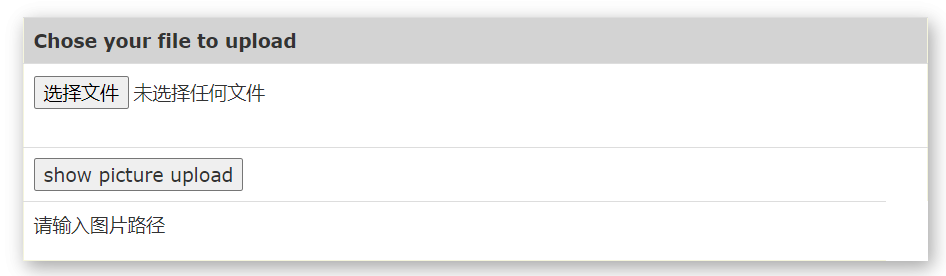

# lab-02

<center><font size='5'> Image similarity search using deep learning</font></center>

<div style="page-break-after: always;"></div>

[toc]

<div style="page-break-after: always;"></div>

## Introduction

This project demonstrates, how we can make use of deep learning to do state-of-the-art image similarity search. I have used tensorflow and some publicly available datasets to process images, and used frame "vue"  to build front end. In this project, you can search information by image, refine result and use result.


## Requirements of image search task

- Searching interface must be designed according to the Five-Stage Framework
- Searching interface must have following features: Formulation, Initiation, Review, Refinement and Use
- Searching interface should be user friendly
- Recognition accuracy should be as high as possible


## How to run

1. Download [imagenet](https://drive.google.com/open?id=1UOyZ8166qM3SzxGvaUeWpBzSUfoQLUjJ) folder, extraxt and keep it in server directory
2. Download datasets for [footwares](http://vision.cs.utexas.edu/projects/finegrained/utzap50k/), [apparels](http://mmlab.ie.cuhk.edu.hk/projects/DeepFashion/InShopRetrieval.html) keep them inside a directory under database folder. Final folder strcture will be as below
```
      root folder  
      │
      └───lib
      │   
      └───server
      |   │───rest-server.py
      |   │───imagenet
      |   │───static
      |   │───templates
      |   │───database
      |        │────tags
      |              │────im2.jpg
      |              │────im3.jpg
      |              │──── ...
      |        │────dataset
      |              │────animals.txt
      |              │────baby.txt
      |              │──── ...
```
3. Run image vectorizer which passes each data through an inception-v3 model and collects the bottleneck layer vectors and stores in disc. Edit dataset paths accordingly indide the image_vectorizer.py
```
  python server/image_vectorizer.py 
```
   This will generate two files namely, image_list.pickle and saved_features.txt. Keep them inside lib folder where search.py script is available.

4. Start the server by running rest-server.py. This project uses flask based REST implementation for UI
```shell
  python server/rest-server.py 
```
5. Once the server starts up, access the url(for example)  100.67.157.9:5000 to get the UI. Now upload any file and see 9 similar images. You can change the value of K from 9 to any values, but dont foreget to update the html file accordingly for displaying.


## Five-stage search framework

### Formulation

#### Description

In formulation, I provide an input box to upload image and a display box to preview the query image. Users can click input box to select the picture they choose and they can use input box box to view the query image. 

- If users click the display box when webpage is displaying the query image, webpage will hide this image.
- If users click  the display box(called "show picture upload") but they haven't chosen any picture, webpage will prompt users that they should input a query image first.
- If users select a non-image file, webpage will hide the display box and prompt users that they should input an image file.
- Only when users choose a image file will webpage displays the search input


#### Display

input box when users haven't chosen any picture


display box


display box when users haven't chosen any picture and click it




display box when users choose a non-image file


display box when webpage shows the query picture


display box when webpage doesn't show the query picture


#### Code

Front-end

```html
...
<div id="search" class="container">
    <table class="table" style="background: white;border: 1px solid beige;box-shadow: 3px 5px 15px 0px rgba(0, 0, 0, 0.2), 3px 5px 15px 0 rgba(0, 0, 0, 0.19);
">
        <tr style="border-left: 0px;display: none" id="uploadImageNote">
            <td>
                <p style="color: brown">
                    <b>
                        请输入图片（包括 .jpg, .png与 .jpeg 格式）,而非其他文件
                    </b>
                </p>
            </td>
            <td><b></b></td>
        </tr>
        <tr style="background: lightgrey;">
            <td><b>Chose your file to upload</b></td>
            <td><b></b></td>
        </tr>
        <tr>
            <td>
                <form id="submit" method=post enctype=multipart/form-data>
                    <input type="file" name="file" id="inputFile" required/>
                    <input type=submit value="Search!" id="searchButton" style="display: none" onclick="fun()">
                </form>
            </td>
            <td><b></b></td>
        </tr>

        <tr>
            <td>
                <button id="show" onclick="showImage()">show picture upload</button>
            </td>
            <td></td>
        </tr>

        <tr>
            <td id="imageShow">
                
                <p id="imageNote"></p>
            </td>
        </tr>

        <tr id="row1" style="display:none;">
            <td><a href="">
                <button id="clear">Clear</button>
            </a></td>
            <td></td>

        </tr>
    </table>
</div>
...

<script>
function showImage() {
        let filename = $('#inputFile').val()
        if (filename.length == 0) {
            $('#imageNote').text('请输入图片路径')
            $('#imageChoose').hide()
            return
        }

        if ($('#imageShow').is(":hidden")) {
            $('#imageNote').text('')
            $('#imageChoose').show()
            $('#imageShow').show()

        } else {
            $('#imageShow').hide()
        }
    }
</script>
```


### Initiation

#### Description

I provide a search button in my webpage, users can click it when they want to search.

- Only when users choose a image file will we display the search input


#### Display

When users don't choose any file, webpage doesn't display the search button


When users choose a non-image file, webpage doesn't display the search button


When users choose an image file, webpage displays the search button


#### Code

Front-end

```html
...

<form id="submit" method=post enctype=multipart/form-data>
   <input type="file" name="file" id="inputFile" required/>
   <input type=submit value="Search!" id="searchButton" style="display: none" onclick="fun()">
</form>
   
...

<script>
	let vue = new Vue({
        el: '#display',
        data: {
            imageList: [],
            showList: [],
            starList: [],
            typeList: [{tagName: 'no select', value: []}],
            totalNum: 0
        },
        methods: {
            ...
    });
            
	function fun() {

        $('#load').show();

        $("form").submit(function (evt) {

            evt.preventDefault();

            let formData = new FormData($(this)[0]);
            $.ajax({
                url: 'imgUpload',
                type: 'POST',
                data: formData,// 上传formdata封装的数据
                async: true,
                // 下面三个参数要指定，如果不指定，会报一个JQuery的错误
                cache: false,// 不缓存
                contentType: false,// 不设置内容类型jQuery不要去设置Content-Type请求头

                processData: false,// jQuery不要去处理发送的数据

                success: function (response) {
                    $('#load').hide();
                    vue.imageList = []
                    vue.imageList.push({
                        fir: response.image0, sec: response.image1,
                        third: response.image2
                    })
                    vue.imageList.push({
                        fir: response.image3, sec: response.image4,
                        third: response.image5
                    })
                    vue.imageList.push({
                        fir: response.image6, sec: response.image7,
                        third: response.image8
                    })
                    console.log(response.image8)
                    $('#table').show();
                    $('#row1').show();
                    $('#clear').show();
                    $('#refine').show();
                    vue.showList = []
                    vue.showList = deepClone(vue.imageList)
                    sendImageList()
                    vue.totalNum = 9
                },
                error: function (errorThrow) {
                    //alert("findImage异常！");
                }
            });
            return false;
        })
    }
</script>
```


back-end

```python
@app.route('/imgUpload', methods=['GET', 'POST'])
def upload_img():
    print("image upload")
    result = 'static/result'
    if not gfile.Exists(result):
        os.mkdir(result)
    shutil.rmtree(result)

    if request.method == 'POST' or request.method == 'GET':
        print(request.method)
        # check if the post request has the file part
        if 'file' not in request.files:
            print('No file part')
            return redirect(request.url)

        file = request.files['file']
        print(file.filename)
        # if user does not select file, browser also
        # submit a empty part without filename
        if file.filename == '':
            print('No selected file')
            return redirect(request.url)
        if file:  # and allowed_file(file.filename):
            filename = secure_filename(file.filename)
            file.save(os.path.join(app.config['UPLOAD_FOLDER'], filename))
            inputloc = os.path.join(app.config['UPLOAD_FOLDER'], filename)
            print(inputloc)
            recommend(inputloc, extracted_features)
            os.remove(inputloc)
            image_path = "/result"
            image_list = [os.path.join(image_path, file) for file in os.listdir(result)
                          if not file.startswith('.')]
            images = {
                'image0': image_list[0],
                'image1': image_list[1],
                'image2': image_list[2],
                'image3': image_list[3],
                'image4': image_list[4],
                'image5': image_list[5],
                'image6': image_list[6],
                'image7': image_list[7],
                'image8': image_list[8]
            }
            print(images)
            return jsonify(images)
```


### Review

#### Description

Users will get the total number of result after searching


#### Display


#### Code

Front-end

```html
...
<div id="display" class="container">
    <div id="refine" style="display: none">
        <p>分类:</p>
        <select onchange="changeShowImage(this.value)">
            <option v-for="item in typeList">{{item.tagName}}</option>
        </select>
        <p><font size="1" color="gray">共有{{totalNum}}条结果</font></p>
    </div>
    ...
</div>
...
<script>
    let vue = new Vue({
        el: '#display',
        data: {
            imageList: [],
            showList: [],
            starList: [],
            typeList: [{tagName: 'no select', value: []}],
            totalNum: 0
        },
        methods: {
            ...
    });

    vue.getStarList()

    function changeShowImage(value) {
        vue.showList = []
        let count = 0
        let all = 0;
        for (let i = 0; i < vue.typeList.length; i++) {
            if (vue.typeList[i]['tagName'] === value) {
                let show = vue.typeList[i]['value']
                let row = {fir: "", sec: "", third: ""}
                for (let i = 0; i < show.length; i++) {
                    if (count === 0) {
                        row.fir = getUrl(show[i])
                    } else if (count === 1) {
                        row.sec = getUrl(show[i])
                    } else if (count === 2) {
                        row.third = getUrl(show[i])
                    }
                    count += 1
                    all += 1
                    if (count === 3) {
                        vue.showList.push(row)
                        row = {fir: "", sec: "", third: ""}
                        count = 0
                    }
                }
                if (count !== 0) {
                    vue.showList.push(row)
                }
            }
        }
        vue.totalNum = all
    }
    ...
</script>
```


### Refinement

#### Description

My project allows users to change search parameters when reviewing results. I achieve this by providing a  classification selection box. Users can review results with certain tag by this box.

- When users change the classification selection box, the overview of the results will change.
- When users choose a certain tag in classification selection box, webpage will display the images with this tag. 
- When users don't choose any tag or choose tag called 'no select', webpage will display the images without limitation. 
- The classification selection box won't provide the tag without result.


#### Display

Classification selection box's default value is 'no select'. In this condition, webpage will display the images without limitation. 


Values classification selection box provides


When users choose value called river


#### Code

Front-end

```html
...
<div id="display" class="container">
    <div id="refine" style="display: none">
        <p>分类:</p>
        <select onchange="changeShowImage(this.value)">
            <option v-for="item in typeList">{{item.tagName}}</option>
        </select>
        <p><font size="1" color="gray">共有{{totalNum}}条结果</font></p>
    </div>
</div>
...
<script>
let vue = new Vue({
        el: '#display',
        data: {
            imageList: [],
            showList: [],
            starList: [],
            typeList: [{tagName: 'no select', value: []}],
            totalNum: 0
        },
        methods: {
            ...
    });
            
function changeShowImage(value) {
        vue.showList = []
        let count = 0
        let all = 0;
        for (let i = 0; i < vue.typeList.length; i++) {
            if (vue.typeList[i]['tagName'] === value) {
                let show = vue.typeList[i]['value']
                let row = {fir: "", sec: "", third: ""}
                for (let i = 0; i < show.length; i++) {
                    if (count === 0) {
                        row.fir = getUrl(show[i])
                    } else if (count === 1) {
                        row.sec = getUrl(show[i])
                    } else if (count === 2) {
                        row.third = getUrl(show[i])
                    }
                    count += 1
                    all += 1
                    if (count === 3) {
                        vue.showList.push(row)
                        row = {fir: "", sec: "", third: ""}
                        count = 0
                    }
                }
                if (count !== 0) {
                    vue.showList.push(row)
                }
            }
        }
        vue.totalNum = all
    }            
</script>
```


back-end

```python
import os


def getTagName(filename):
    end = filename.split('\\')[-1]
    name = end.split('.')[0]
    return name


def get_types(imageList):
    imageList = imageList.split(',')
    print(imageList)
    for i in range(len(imageList)):
        imageList[i] = int(imageList[i])
    typeList = [{'tagName': 'no select', 'value': imageList}]
    nameIndex = {}
    filename = 'database\\tags'
    fileList = []
    for filepath, dirnames, filenames in os.walk(filename):
        for filename in filenames:
            fileList.append(os.path.join(filepath, filename))
    print(fileList)
    for filepath in fileList:
        count = 0
        with open(filepath, 'r', errors='ignore') as f:
            for line in f:  # 读取每一行
                for imageIndex in imageList:
                    if int(line) == int(imageIndex):
                        count = count + 1
                        if count == 1:
                            typeList.append({'tagName': getTagName(filepath),
                                             'value': [imageIndex]})
                            nameIndex[getTagName(filepath)] = len(typeList) - 1
                        else:
                            typeList[nameIndex[getTagName(filepath)]]['value'].append(imageIndex)
    print(typeList)
    return typeList


@app.route('/getTypes', methods=['GET', 'POST'])
def get_type():
    print("get type")
    imageList = request.values.get('imageList')
    print(imageList)

    if request.method == 'POST' or request.method == 'GET':
        print(request.method)
        typeList = get_types(imageList)
        return jsonify({'typeList': typeList})
```


### Use

#### Description

Users can select images to a favorite list.

- After searching results and refining results, if one result image is already in the favorite list, a filled star will appear below this image. If one result image isn't in the favorite list, a empty star will appear below this image.
- In 'main.html', users can collect images by click empty star below the image. After clicked, this image will be added to the favorite list and the empty star will become a filled star.
-  In 'main.html', users can cancel collection by click filled star below the image. After clicked, this image will be deleted from the favorite list and the filled star will become a empty star.
- In 'collection.html', users can cancel collection by click a trash can icon below the image they want to cancel. After cancelling, this image will disappear from 'collection.html' and the favorite list.
- Users can change webpage by navigation bar.


#### Display

Navigation Bar


Use in main.html


Use in collection.html


#### Code

front-end   collection.html

```html
<div id="display" class="container">
    <p><font size="1" color="gray">您共有{{imageList.length}}个收藏</font></p>
    <table id="table" class="table" style="background: white; border: 1px">
        <br/><br/><br/><br/>
        <tbody>
        <tr v-for="item in showList">
            <td style="
    box-shadow: 0 4px 8px 0 rgba(0,0,0,0.2);
    transition: 0.3s;
    width: 200px;
    height: 200px;
    padding-top: 0px;
    padding-bottom: 0px;
    padding-right: 0px;
    padding-left: 0px;
    border-left-width: 1px;
    border-bottom-width: 1px;border-right-width: 1px;background: white;
" v-show="item.fir != ''">
                
                <br/><br/>
                &nbsp;&nbsp;&nbsp;&nbsp;
                <br/><br/>
            </td>

            <td style="
    box-shadow: 0 4px 8px 0 rgba(0,0,0,0.2);
    transition: 0.3s;
    width: 200px;
    height: 200px;
    padding-top: 0px;
    padding-bottom: 0px;
    padding-right: 0px;
    padding-left: 0px;
    border-left-width: 1px;
    border-bottom-width: 1px;border-right-width: 1px;background: white;
" v-show="item.sec != ''">
                
                <br/><br/>
                &nbsp;&nbsp;&nbsp;&nbsp;
                <br/><br/>
            </td>
            <td style="
    box-shadow: 0 4px 8px 0 rgba(0,0,0,0.2);
    transition: 0.3s;
    width: 200px;
    height: 200px;
    padding-top: 0px;
    padding-bottom: 0px;
    padding-right: 0px;
    padding-left: 0px;
    border-left-width: 1px;
    border-bottom-width: 1px;border-right-width: 1px;background: white;
" v-show="item.third != ''">
                
                <br/><br/>
                &nbsp;&nbsp;&nbsp;&nbsp;
                <br/><br/>
            </td>
        </tr>
        </tbody>
    </table>
</div>
</body>

<script type="text/javascript">
    let vue = new Vue({
        el: '#display',
        data: {
            imageList: [],
            showList: []
        },
        methods: {
            delStar: function (e) {
                let formData = new FormData();
                let delPath = e.currentTarget.previousElementSibling
                    .previousElementSibling.previousElementSibling.src
                formData.append('imageDel', delPath)
                $.ajax({
                    url: 'delStar',
                    type: 'POST',
                    data: formData,// 上传formdata封装的数据
                    async: true,
                    // 下面三个参数要指定，如果不指定，会报一个JQuery的错误
                    cache: false,// 不缓存
                    contentType: false,// 不设置内容类型jQuery不要去设置Content-Type请求头

                    processData: false,// jQuery不要去处理发送的数据

                    success: function (response) {
                        vue.imageList = response.imageList
                        changeShowImage()
                    },
                    error: function (errorThrow) {

                    }
                });
            }
        }
    });


    this.updateImage()

    function updateImage() {
        let formData = new FormData();
        $.ajax({
            url: 'getStar',
            type: 'POST',
            data: formData,// 上传formdata封装的数据
            async: true,
            // 下面三个参数要指定，如果不指定，会报一个JQuery的错误
            cache: false,// 不缓存
            contentType: false,// 不设置内容类型jQuery不要去设置Content-Type请求头

            processData: false,// jQuery不要去处理发送的数据

            success: function (response) {
                vue.imageList = response.imageList
                changeShowImage()
            },
            error: function (errorThrow) {

            }
        });
    }

    function changeShowImage() {
        vue.showList = []
        let count = 0
        let show = vue.imageList
        let row = {fir: "", sec: "", third: ""}
        for (let i = 0; i < show.length; i++) {
            if (count === 0) {
                row.fir = show[i]
            } else if (count === 1) {
                row.sec = show[i]
            } else if (count === 2) {
                row.third = show[i]
            }
            count += 1
            if (count === 3) {
                vue.showList.push(row)
                row = {fir: "", sec: "", third: ""}
                count = 0
            }
        }
        if (count !== 0) {
            vue.showList.push(row)
        }
    }

</script>
```


front-end   main.html

```html
<!DOCTYPE html>
<html>
...
    <table id="table" class="table" style="background: white; border: 1px;display:none">
        <tbody>
        <tr v-for="item in showList">
            <td style="
    box-shadow: 0 4px 8px 0 rgba(0,0,0,0.2);
    transition: 0.3s;
    width: 200px;
    height: 200px;
    padding-top: 0px;
    padding-bottom: 0px;
    padding-right: 0px;
    padding-left: 0px;
    border-left-width: 1px;
    border-bottom-width: 1px;border-right-width: 1px;background: white;
" v-show="item.fir != ''">
                
                <br/><br/>
                &nbsp;&nbsp;&nbsp;&nbsp;
                
                <br/><br/>
            </td>

            <td style="
    box-shadow: 0 4px 8px 0 rgba(0,0,0,0.2);
    transition: 0.3s;
    width: 200px;
    height: 200px;
    padding-top: 0px;
    padding-bottom: 0px;
    padding-right: 0px;
    padding-left: 0px;
    border-left-width: 1px;
    border-bottom-width: 1px;border-right-width: 1px;background: white;
" v-show="item.sec != ''">
                
                <br/><br/>
                &nbsp;&nbsp;&nbsp;&nbsp;
                
                <br/><br/>
            </td>
            <td style="
    box-shadow: 0 4px 8px 0 rgba(0,0,0,0.2);
    transition: 0.3s;
    width: 200px;
    height: 200px;
    padding-top: 0px;
    padding-bottom: 0px;
    padding-right: 0px;
    padding-left: 0px;
    border-left-width: 1px;
    border-bottom-width: 1px;border-right-width: 1px;background: white;
" v-show="item.third != ''">
                
                <br/><br/>
                &nbsp;&nbsp;&nbsp;&nbsp;
                
                <br/><br/>
            </td>
        </tr>
        </tbody>
    </table>
</div>
</body>

<script type="text/javascript">
    let vue = new Vue({
        el: '#display',
        data: {
            imageList: [],
            showList: [],
            starList: [],
            typeList: [{tagName: 'no select', value: []}],
            totalNum: 0
        },
        methods: {
            clickStar: function (e) {
                let src = e.currentTarget.src.split('/').pop()
                if (src === 'star_empty.png') {
                    e.currentTarget.src = 'images/star_filled.png'
                    this.starImage(e)
                } else {
                    e.currentTarget.src = 'images/star_empty.png'
                    this.deleteStar(e)
                }
            },
            clickStarBehind: function (e) {
                let src = e.currentTarget.src.split('/').pop()
                if (src === 'star_empty.png') {
                    e.currentTarget.src = 'images/star_filled.png'
                    this.starImage(e, 1)
                } else {
                    e.currentTarget.src = 'images/star_empty.png'
                    this.deleteStar(e, 1)
                }
            },
            starImage: function (e, index = 0) {
                let formData = new FormData();
                let delPath = e.currentTarget.previousElementSibling
                    .previousElementSibling.previousElementSibling.src
                if (index === 1) {
                    delPath = e.currentTarget.previousElementSibling
                        .previousElementSibling.previousElementSibling.previousElementSibling.src
                }
                formData.append('imageStar', delPath)
                $.ajax({
                    url: 'addStar',
                    type: 'POST',
                    data: formData,// 上传formdata封装的数据
                    async: true,
                    // 下面三个参数要指定，如果不指定，会报一个JQuery的错误
                    cache: false,// 不缓存
                    contentType: false,// 不设置内容类型jQuery不要去设置Content-Type请求头

                    processData: false,// jQuery不要去处理发送的数据

                    success: function (response) {
                        console.log('add success')
                    },
                    error: function (errorThrow) {

                    }
                });
            },
            deleteStar: function (e, index = 0) {
                let formData = new FormData();
                let delPath = e.currentTarget.previousElementSibling
                    .previousElementSibling.previousElementSibling.src
                if (index === 1) {
                    delPath = e.currentTarget.previousElementSibling
                        .previousElementSibling.previousElementSibling.previousElementSibling.src
                }
                formData.append('imageDel', delPath)
                $.ajax({
                    url: 'delStar',
                    type: 'POST',
                    data: formData,// 上传formdata封装的数据
                    async: true,
                    // 下面三个参数要指定，如果不指定，会报一个JQuery的错误
                    cache: false,// 不缓存
                    contentType: false,// 不设置内容类型jQuery不要去设置Content-Type请求头

                    processData: false,// jQuery不要去处理发送的数据

                    success: function (response) {
                        console.log('del success')
                    },
                    error: function (errorThrow) {

                    }
                });
            },
            getStarList: function () {
                let formData = new FormData();
                $.ajax({
                    url: 'getStar',
                    type: 'POST',
                    data: formData,// 上传formdata封装的数据
                    async: true,
                    // 下面三个参数要指定，如果不指定，会报一个JQuery的错误
                    cache: false,// 不缓存
                    contentType: false,// 不设置内容类型jQuery不要去设置Content-Type请求头

                    processData: false,// jQuery不要去处理发送的数据

                    success: function (response) {
                        vue.starList = response.imageList
                        console.log(vue.starList)
                    },
                    error: function (errorThrow) {

                    }
                });
            },
            isInStar: function (src) {
                src = src.split('/')
                let srcName = src[src.length - 1]
                let srcIndex = getImageIndex(srcName)
                for (let i = 0; i < this.starList.length; i++) {
                    let tempList = this.starList[i].split('/')
                    let tempName = tempList[tempList.length - 1]
                    if (getImageIndex(tempName) === srcIndex) {
                        return true
                    }
                }
                return false
            }
        },
    });

    vue.getStarList()

...

</script>
</html>

```


end-end

```python
import os
import matplotlib.image as mpimg
from tensorflow.python.platform import gfile

basePath = os.getcwd()


def getTagName(filename):
    fir = filename.split('\\')[-1]
    end = fir.split('/')[-1]
    return end


def add_star(imageStar):
    baseFile = 'static\\result'
    for filepath, dirnames, filenames in os.walk(baseFile):
        for filename in filenames:
            if getTagName(filename) == getTagName(imageStar):
                starBase = 'static/star'
                if not gfile.Exists(starBase):
                    os.mkdir(starBase)

                readFile = basePath + '\\' + os.path.join(filepath, filename)
                writeFile = basePath + '\\' + os.path.join(starBase, filename)
                print(writeFile)
                image = mpimg.imread(readFile)
                mpimg.imsave(writeFile, image)
    return True


def del_star(imageDel):
    baseFile = 'static\\star'
    for filepath, dirnames, filenames in os.walk(baseFile):
        for filename in filenames:
            if getTagName(filename) == getTagName(imageDel):
                starBase = 'static/star'
                if not gfile.Exists(starBase):
                    os.mkdir(starBase)

                delFile = basePath + '\\' + os.path.join(filepath, filename)
                print(delFile)
                os.remove(delFile)
    return True


def get_star_list():
    imageList = []
    baseFile = 'static\\star'
    for filepath, dirnames, filenames in os.walk(baseFile):
        for filename in filenames:
            imageList.append('star\\' + filename)
    return imageList


@app.route('/getStar', methods=['GET', 'POST'])
def get_star():
    print("get star")
    imageList = star.get_star_list()
    return jsonify({'imageList': imageList})


@app.route('/delStar', methods=['GET', 'POST'])
def del_star():
    print("del star")
    imageDel = request.values.get('imageDel')
    print(imageDel)
    star.del_star(imageDel)
    imageList = star.get_star_list()
    return jsonify({'imageList': imageList})


@app.route('/addStar', methods=['GET', 'POST'])
def add_star():
    print("add star")
    imageStar = request.values.get('imageStar')
    star.add_star(imageStar)
    imageList = star.get_star_list()
    return jsonify({'imageList': imageList})
```

